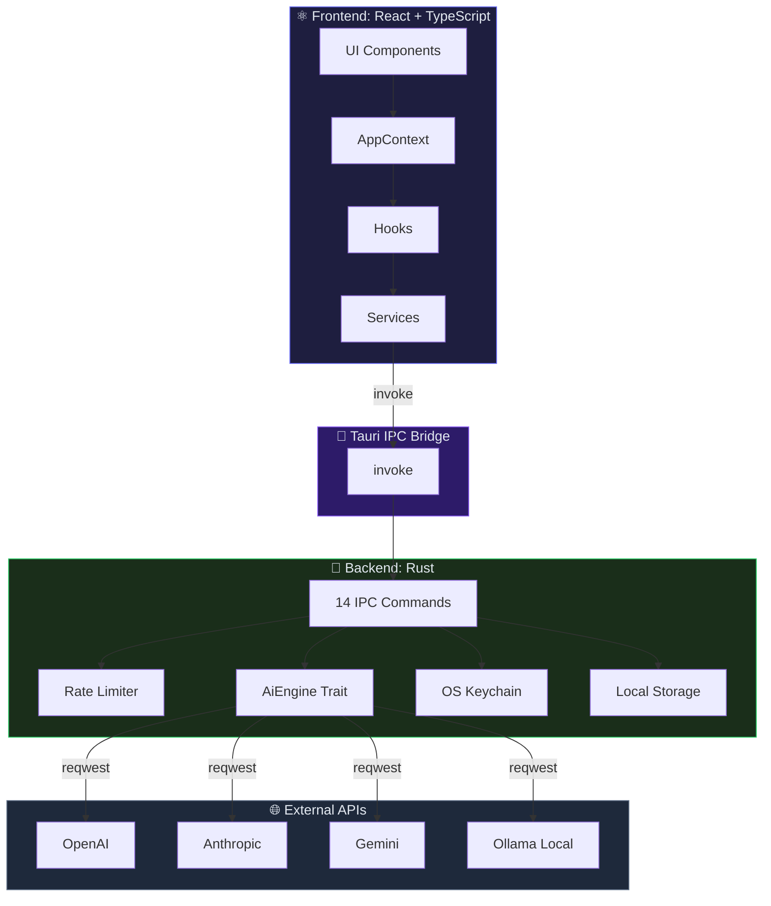

# Nexus Prompt Suite — Development Blueprint

Technical reference for maintaining and scaling the Nexus Prompt Suite infrastructure.

---

## 🏗️ Architecture Deep-Dive

### High-Level Pattern: Hybrid Monolith

The application follows a **Decoupled Backend/Frontend Architecture** bridged by Tauri's IPC (Inter-Process Communication).

- **Frontend (UI Library)**: A Vite-powered React application. It handles state management (Context API), tab-based routing, dynamic form rendering (8 field types), and Markdown output display with real-time streaming.
- **Backend (System Layer)**: A Rust core managing safe I/O, native credential storage (Keyring), rate limiting, and high-performance AI orchestration across 12 providers via `reqwest` with SSE streaming.

### Design Principles

| Principle | Implementation |
| :--- | :--- |
| **Secure by default** | API keys encrypted in OS Keychain via `keyring-rs` (never in plain text on disk). JSON sanitization before persistence (CWE-312). 1MB file read cap (CWE-400). Endpoint whitelist with SSRF protection. AES-GCM encrypted localStorage. |
| **Radical privacy** | Zero telemetry, zero servers, zero external logging. Everything runs locally. API key redaction in all console output via `safeLog()`. |
| **Native performance** | Rust backend with async `reqwest` + SSE streaming. React frontend with Vite tree-shaking and lazy loading (`React.Suspense`). |
| **Strict typing** | TypeScript `strict: true` on the frontend. Algebraic types and trait system in Rust on the backend. |
| **Extensibility** | Provider architecture via `AiEngine` trait with per-provider engine implementations (`ollama.rs`, `anthropic.rs`, `gemini.rs`, `openai_compat.rs`). Templates defined as data (not hardcoded in UI). |
| **Resilience** | Rate limiter (30 req/60s, 3 concurrent). RAII guard pattern for automatic release. Stream buffer caps (256KB). Model fetch timeout (10s). |

### Architecture Diagram



---

## 📂 Project Structure

```
nexus-prompt-suite/
│
├── prompt-suite/                    # 🏗️ Main Tauri + Frontend workspace
│   │
│   ├── src-tauri/                   # 🦀 Rust Backend (Native Core)
│   │   ├── Cargo.toml               #    Rust dependencies (reqwest, keyring, serde, tokio, futures)
│   │   ├── tauri.conf.json          #    Tauri app config (window, bundle, CSP)
│   │   ├── capabilities/
│   │   │   └── default.json         #    Permission manifest (core:default, shell:allow-open)
│   │   └── src/
│   │       ├── main.rs              #    Entry point → app_lib::run()
│   │       ├── lib.rs               #    🧠 Tauri IPC Bridge — 14 backend commands
│   │       │                        #       • get/save_settings (local preferences)
│   │       │                        #       • call_ai / call_ai_stream (inference + SSE)
│   │       │                        #       • list_ollama_models / list_provider_models
│   │       │                        #       • get_available_providers (12 providers)
│   │       │                        #       • save/get_api_key_secure (OS Keychain, legacy)
│   │       │                        #       • save/get_provider_api_key (per-provider)
│   │       │                        #       • secure_storage_set/get/remove (AES-GCM)
│   │       ├── rate_limiter.rs      #    🚦 Rate limiter — 30 req/60s, 3 concurrent, RAII guard
│   │       ├── tests.rs             #    🧪 12 unit tests with MockAiEngine (4 phases)
│   │       └── ai/                  #    ⚙️ AI Engine Module
│   │           ├── mod.rs           #       Module re-exports
│   │           ├── engine.rs        #       AiEngine trait + DefaultAiEngine (key resolution, SSE parsing)
│   │           ├── providers.rs     #       12 provider definitions with metadata
│   │           ├── types.rs         #       Core types (Message, Provider enum, ProviderInfo)
│   │           └── engines/         #       Per-provider engine implementations
│   │               ├── mod.rs
│   │               ├── ollama.rs         #  Ollama — /api/chat + NDJSON streaming
│   │               ├── anthropic.rs      #  Anthropic — x-api-key + system message extraction
│   │               ├── gemini.rs         #  Google Gemini — x-goog-api-key + model sanitization
│   │               └── openai_compat.rs  #  OpenAI-compatible — 8 providers, SSE streaming
│   │
│   ├── src/renderer/                # ⚛️ Frontend React + TypeScript
│   │   ├── index.html               #    HTML shell with strict CSP headers
│   │   └── src/
│   │       ├── main.tsx             #    React entry point (StrictMode)
│   │       ├── App.tsx              #    🧩 Root component — tab routing + Suspense
│   │       ├── index.css            #    🎨 Tailwind + dark theme HSL + responsive
│   │       ├── components/          #    🧱 UI Components
│   │       │   ├── Layout.tsx       #       Main shell (Sidebar + Main)
│   │       │   ├── Sidebar.tsx      #       Collapsible nav with 7 sections
│   │       │   ├── SettingsDashboard.tsx  # Full settings panel (provider, keys, models, i18n)
│   │       │   └── ui/              #       Reusable atomic components
│   │       │       ├── DynamicForm.tsx    #  Form renderer (8 field types)
│   │       │       ├── FormField.tsx      #  Single field with a11y
│   │       │       ├── PromptViewerPanel.tsx  # Prompt viewer with Original/Optimized toggle
│   │       │       ├── LLMStatusIndicator.tsx # Visual inference progress indicator
│   │       │       └── LoadingSpinner.tsx  # Size-variant spinner
│   │       ├── contexts/
│   │       │   └── AppContext.tsx    #    🌐 Global state (settings, i18n, models, provider config)
│   │       ├── features/
│   │       │   ├── suite/           #    🎯 Prompt generation suites
│   │       │   │   ├── PromptSuite.tsx     # Core workspace (3 view modes: Form, Prompt, Split)
│   │       │   │   ├── ChatView.tsx        # Chat interaction with AI
│   │       │   │   ├── SuiteGenesis.tsx    # Genesis Lab — 7 ideation techniques, 4 prompting modes
│   │       │   │   ├── SuiteDev.tsx        # Software Architect — 9 project types, 6 focus areas
│   │       │   │   ├── SuiteAudit.tsx      # Code Auditor — 8 scan types, compliance frameworks
│   │       │   │   ├── SuiteStudio.tsx     # Content Studio — 15 content formats, mental frameworks
│   │       │   │   ├── SuiteSocial.tsx     # Social Strategist — hooks, triggers, frameworks
│   │       │   │   ├── SuiteTemplates.tsx  # Template Library — 60+ bilingual templates
│   │       │   │   ├── SuiteOutputPanel.tsx # Shared output panel for suite results
│   │       │   │   ├── data.ts            # Bulk data (templates, configs)
│   │       │   │   └── formSchemas.ts     # Dynamic form schema definitions
│   │       │   └── matrix/          #    Alternative prompt matrix (3 categories)
│   │       ├── hooks/               #    🪝 Custom hooks
│   │       │   ├── useAIInference.ts        # Core AI inference hook (streaming + non-streaming)
│   │       │   ├── useAIInference.test.tsx  # Inference hook unit tests
│   │       │   ├── usePromptGenerator.ts    # Prompt state management + export
│   │       │   └── useDebounce.ts           # Generic debounce utility
│   │       ├── lib/
│   │       │   ├── i18n.ts           #    🌍 Full bilingual translations (ES/EN, 447 lines)
│   │       │   ├── utils.ts          #    🔧 cn() class merging, safeLog() with API key redaction, sanitizeAIOutput()
│   │       │   └── secureStorage.ts  #    🔐 AES-GCM encrypted localStorage with OS keychain keys
│   │       └── services/
│   │           └── ai.ts             #    🔌 AI service abstraction — wraps Tauri invoke() calls
│   │
│   ├── package.json                  # Node dependencies (React 18, Tailwind, Vitest, Lucide, etc.)
│   ├── vite.config.ts                # Vite + Vitest + path alias config
│   ├── tsconfig.json                 # Strict TypeScript config
│   ├── tailwind.config.cjs           # Tailwind theme with HSL CSS design tokens
│   └── postcss.config.cjs            # PostCSS (Tailwind + Autoprefixer)
│
├── docs/
│   └── INLINE_STANDARDS.md           # 📐 Inline doc standards (RustDoc + JSDoc)
├── .github/workflows/
│   └── build-and-release.yml         # 🔄 CI/CD — multi-platform matrix builds + security scans
├── VERSION                           # 🔖 Current version (1.1.0)
├── LICENSE                           # 📜 MIT License
├── README.md                         # 📄 Project overview
└── DEVELOPMENT.md                    # 📖 This document
```

---

## 🛠️ Local Environment Setup

### Prerequisites

- **Node.js 20+**
- **Rust Stable** (≥ 1.77.2, installed via [rustup](https://rustup.rs))
- **OS Dependencies**:
  - **Windows**: WebView2 (usually pre-installed). MSVC C++ Build Tools.
  - **Linux**: `libwebkit2gtk-4.1-dev libssl-dev libgtk-3-dev libayatana-appindicator3-dev librsvg2-dev`.
  - **macOS**: Xcode Command Line Tools (`xcode-select --install`).

### Initial Setup

```bash
cd prompt-suite
# Resolve peer dependencies explicitly due to strict vite/vitest requirements
npm install --legacy-peer-deps
```

### Development Execution

```bash
npm run tauri dev
```

Starts the Vite dev server (HMR) at `localhost:5173` + native Tauri window with Rust backend hot reload.

### Production Build

```bash
npm run tauri build
```

Generates the optimized binary for your current platform at `src-tauri/target/release/bundle/`.

---

## 🔄 Data Flow & Security

### Tauri IPC Commands (14 total)

Commands in `lib.rs` use the `#[tauri::command]` macro and are registered via `tauri::generate_handler!`.

| Command | Category | Description |
| :--- | :--- | :--- |
| `get_settings` | Settings | Reads preferences from local JSON file (1MB cap) |
| `save_settings` | Settings | Persists preferences, strips API keys before write (CWE-312) |
| `call_ai` | Inference | Non-streaming AI inference via `AiEngine` trait |
| `call_ai_stream` | Inference | Streaming AI inference via SSE |
| `list_ollama_models` | Models | Queries local Ollama `/api/tags` |
| `list_provider_models` | Models | Fetches model list from remote provider (10s timeout) |
| `get_available_providers` | Providers | Returns metadata for all 12 providers |
| `save_api_key_secure` | Keychain (legacy) | Stores API key in OS-native credential manager |
| `get_api_key_secure` | Keychain (legacy) | Retrieves stored API key |
| `save_provider_api_key` | Keychain | Per-provider API key storage with keyring suffix |
| `get_provider_api_key` | Keychain | Per-provider API key retrieval |
| `secure_storage_set` | Storage | AES-GCM encrypted key-value write |
| `secure_storage_get` | Storage | AES-GCM encrypted key-value read |
| `secure_storage_remove` | Storage | AES-GCM encrypted key-value deletion |

### Security Hardening

| Measure | Implementation |
| :--- | :--- |
| **Memory hardening** | File reads capped at 1MB (CWE-400). Message content ≤ 128KB. Stream buffer ≤ 256KB. Max 200 messages per request. |
| **Secret resolution** | API keys stored exclusively in OS keychain via `keyring-rs`. Never in plain JSON files. Console output redacted via `safeLog()`. |
| **SSRF protection** | Endpoint whitelist (7 remote hosts). URL credential detection. HTTPS enforcement for remote endpoints. |
| **Rate limiting** | 30 requests per 60 seconds. Max 3 concurrent AI requests. RAII guard pattern for automatic release on drop. |
| **Error sanitization** | Debug builds return detailed errors. Production builds return generic messages to prevent information leakage. |

### Performance Optimizations

- **Tree-Shaking**: Vite optimizes the production bundle to reduce load times.
- **Lazy Loading**: Suite views loaded via `React.Suspense` to reduce initial JS overhead.
- **Async I/O**: All AI inference and file operations are non-blocking via `tokio`.
- **SSE Streaming**: Real-time token streaming for supported providers (OpenAI-compatible, Anthropic, Ollama, Gemini).

---

## 🧪 Testing Protocols

### Frontend (Vitest)

Unit tests for hooks and components:

```bash
npm test
```

| Tool | Purpose |
| :--- | :--- |
| **Vitest** | Test runner (Vite-native, fast) |
| **happy-dom** | Lightweight DOM environment |
| **@testing-library/react** | Component rendering and queries |
| **@testing-library/user-event** | Simulated user interactions |

Test files are co-located with their implementation (e.g., `useAIInference.test.tsx` beside `useAIInference.ts`).

### Backend (Cargo)

Rust tests for AI logic, security, and performance:

```bash
cargo test --manifest-path src-tauri/Cargo.toml
```

**12 unit tests** across 4 phases using `MockAiEngine`:

| Phase | Tests | Scope |
| :--- | :--- | :--- |
| **1 — Happy path** | `test_happy_path_valid_call` | Valid provider, API key, and messages → successful mocked response |
| **2 — Hostile path** | `test_hostile_missing_api_key`<br/>`test_hostile_empty_messages`<br/>`test_hostile_network_timeout` | Missing API key rejection, empty message handling, simulated network timeout resilience |
| **3 — Security** | `test_is_localhost_accepted`<br/>`test_is_localhost_rejected`<br/>`test_is_allowed_endpoint_exact_match`<br/>`test_is_allowed_endpoint_subdomain`<br/>`test_is_allowed_endpoint_bypass_blocked`<br/>`test_is_allowed_endpoint_localhost`<br/>`test_is_allowed_endpoint_empty` | Localhost validation, whitelist matching, subdomain allowlisting, SSRF bypass rejection |
| **4 — Performance** | `test_performance_massive_payload` | 100K character payload processed in under 50ms |

### Typecheck

```bash
npx tsc --noEmit
```

Zero-cost verification: no type errors = clean build.

### Full Validation Chain

```bash
# Frontend
npm test                     # Vitest suite

# Backend
cargo test                   # Rust unit tests
cargo clippy -- -D warnings  # Lint (deny warnings)
cargo fmt --check            # Format verification

# TypeScript
npx tsc --noEmit             # Type checking

# Security
cargo audit                  # Rust dependency vulnerability scan
npm audit                    # Frontend dependency audit
```

---

## 🚀 CI/CD & Deployment

The project uses GitHub Actions (`.github/workflows/build-and-release.yml`) to generate production binaries:

1. **Trigger**: Pushing a tag (e.g., `v1.1.0`) or manual `workflow_dispatch`.
2. **Matrix**: Parallel builds for:
   - `macos-latest` (aarch64 and x86_64)
   - `ubuntu-22.04`
   - `windows-latest`
3. **Pipeline stages**:
   | Stage | Commands |
   | :--- | :--- |
   | Checkout | `actions/checkout@v4` |
   | Node.js | Setup v22 + cache |
   | Rust | `rustup` stable + `rustup target add` |
   | System deps | Linux: `libwebkit2gtk`, `libssl`, `libgtk` / macOS: Xcode CLT |
   | Install | `npm install --legacy-peer-deps` |
   | Lint | `cargo clippy -- -D warnings` + `cargo fmt --check` |
   | Typecheck | `npx tsc --noEmit` |
   | Test | `npm test` (Vitest) + `cargo test` |
   | Audit | `cargo audit` + `npm audit` |
   | SBOM | Generate CycloneDX software bill of materials |
   | Build | `npm run tauri build` per platform |
   | Sign | macOS notarization + Windows code signing |
   | Attest | SLSA provenance attestation |
   | Release | Draft GitHub Release with attached binaries |

---

## 🌱 Contribution Guidelines

### Commit Convention

We strictly follow [Conventional Commits](https://www.conventionalcommits.org/):

```
feat: add Gemini streaming support
fix: resolve race condition in get_settings on startup
docs: update usage examples in README
chore: bump Tauri dependencies to v2.11.5
test: add integration tests for code auditor
refactor: extract keyring logic to separate module
```

### Pull Request Template

```markdown
## 📋 Description
[Brief summary of the change]

## 🎯 Change Type
- [ ] feat: New feature
- [ ] fix: Bug fix
- [ ] docs: Documentation
- [ ] refactor: Refactoring
- [ ] test: Tests
- [ ] chore: Maintenance

## 🧪 Testing
- [ ] Unit tests added/updated
- [ ] `cargo test` passes (backend)
- [ ] `npm test` passes (frontend)
- [ ] `tsc --noEmit` passes (typecheck)

## ✅ Checklist
- [ ] Code follows [Inline Documentation Standards](./docs/INLINE_STANDARDS.md)
- [ ] No `unsafe` blocks in Rust without explicit justification
- [ ] All TypeScript code is fully typed (`strict: true`)
- [ ] Production build compiles without errors
```

### Code Standards

See [`docs/INLINE_STANDARDS.md`](./docs/INLINE_STANDARDS.md) for documentation conventions:

- **Rust**: RustDoc with `# Arguments`, `# Returns`, `# Errors` sections.
- **TypeScript**: JSDoc with `@param`, `@returns`, `@throws` annotations.

### Bug Reports

1. Verify the bug hasn't been reported in [Issues](https://github.com/ekosistema/nexus-prompt-suite/issues).
2. Use the bug report template and include:
   - **Version** of Nexus Prompt Suite.
   - **Operating system** and architecture.
   - **AI provider** and model used.
   - **Steps to reproduce** the error.
   - **Expected vs. observed behavior**.

---

🚀 **CeleroLab Technical Division** | [Technical Support](mailto:tech@celerolab.com)
