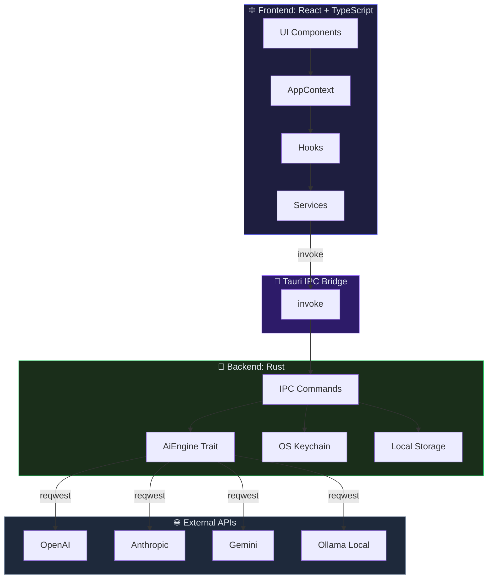

# Nexus Prompt Suite — Development Blueprint

Technical reference for maintaining and scaling the Prompt Suite infrastructure.

---

## 🏗️ Architecture Deep-Dive

### High-Level Pattern: Hybrid Monolith

The application follows a **Decoupled Backend/Frontend Architecture** bridged by Tauri's IPC (Inter-Process Communication).

- **Frontend (UI Library)**: A Vite-powered React application. It handles state management (Context API), routing, and rendering structured Markdown.
- **Backend (System Layer)**: A Rust core managing safe I/O, native credential storage (Keyring), and high-performance AI orchestration via `reqwest`.

### Design Principles

| Principle | Implementation |
| :--- | :--- |
| **Secure by default** | API keys encrypted in OS Keychain (never in plain text on disk). JSON sanitization before persistence. 1MB file read cap (CWE-400 mitigation). |
| **Radical privacy** | Zero telemetry, zero servers, zero external logging. Everything runs locally. |
| **Native performance** | Rust backend with async `reqwest` + SSE streaming. React frontend with Vite tree-shaking and lazy loading. |
| **Strict typing** | TypeScript `strict: true` on the frontend. Algebraic types and trait system in Rust on the backend. |
| **Extensibility** | Provider architecture via `AiEngine` trait. Templates defined as data (not hardcoded in UI). |

### Architecture Diagram



---

## 📂 Project Structure

```bash
prompt-suite-ia/
│
├── prompt-suite/                    # 🏗️ Main Tauri + Frontend workspace
│   │
│   ├── src-tauri/                   # 🦀 Rust Backend (Native Core)
│   │   ├── Cargo.toml               #    Rust dependencies (reqwest, keyring, serde, tokio)
│   │   ├── tauri.conf.json          #    Tauri app config (window, bundle, CSP)
│   │   └── src/
│   │       ├── main.rs              #    Entry point → app_lib::run()
│   │       ├── lib.rs               #    🧠 Tauri IPC Bridge — 10 backend commands
│   │       │                        #       • get/save_settings (local preferences)
│   │       │                        #       • call_ai / call_ai_stream (inference)
│   │       │                        #       • list_models / get_providers
│   │       │                        #       • save/get_api_key_secure (OS Keychain)
│   │       ├── ai.rs                #    ⚙️ AI Engine — 12 providers, AiEngine trait
│   │       └── tests.rs             #    🧪 Unit tests with MockAiEngine
│   │
│   ├── src/renderer/                # ⚛️ Frontend React + TypeScript
│   │   ├── index.html               #    HTML shell with CSP headers
│   │   └── src/
│   │       ├── main.tsx             #    React entry point (StrictMode)
│   │       ├── App.tsx              #    🧩 Root component — tab routing
│   │       ├── index.css            #    🎨 Tailwind + dark theme HSL + responsive
│   │       ├── components/          #    🧱 UI Components
│   │       │   ├── Layout.tsx       #       Main shell (Sidebar + Main)
│   │       │   ├── Sidebar.tsx      #       Collapsible nav with 7 sections
│   │       │   ├── SettingsDashboard.tsx  # Full settings panel
│   │       │   └── ui/              #       Reusable atomic components
│   │       │       ├── DynamicForm.tsx    #  Form renderer (8 field types)
│   │       │       ├── FormField.tsx      #  Single field with a11y
│   │       │       ├── PromptViewerPanel  #  Prompt viewer with Original/Optimized toggle
│   │       │       ├── LLMStatusIndicator # Visual inference progress indicator
│   │       │       └── LoadingSpinner.tsx  # Size-variant spinner
│   │       ├── contexts/
│   │       │   └── AppContext.tsx    #    🌐 Global state (settings, i18n, models)
│   │       ├── features/
│   │       │   ├── suite/           #    🎯 Prompt generation suites
│   │       │   │   ├── PromptSuite.tsx     # Core workspace (3 view modes)
│   │       │   │   ├── SuiteGenesis.tsx    # Genesis Lab — creative prompts
│   │       │   │   ├── SuiteDev.tsx        # Software Architect — technical prompts
│   │       │   │   ├── SuiteAudit.tsx      # Code Auditor — code auditing
│   │       │   │   ├── SuiteStudio.tsx     # Content Studio — content generation
│   │       │   │   ├── SuiteSocial.tsx     # Social Strategist — social strategy
│   │       │   │   ├── SuiteTemplates.tsx  # Template Library — 60+ templates
│   │       │   │   ├── data.ts            # Bulk data (templates, configs)
│   │       │   │   └── formSchemas.ts     # Dynamic form schemas
│   │       │   └── matrix/          #    Alternative prompt matrix (3 categories)
│   │       ├── hooks/               #    🪝 Custom hooks
│   │       │   ├── useAIInference.ts        # Core AI inference hook
│   │       │   ├── usePromptGenerator.ts    # Prompt state + export
│   │       │   └── useDebounce.ts           # Generic debounce
│   │       ├── lib/
│   │       │   ├── i18n.ts           #    🌍 Internationalization (ES/EN)
│   │       │   └── utils.ts          #    Utilities (cn helper)
│   │       └── services/
│   │           └── ai.ts             #    🔌 AI service abstraction (IPC calls)
│   │
│   ├── package.json                  # Node dependencies (React, Tailwind, Vitest, etc.)
│   ├── vite.config.ts                # Vite + Vitest + alias config
│   ├── tsconfig.json                 # Strict TypeScript config
│   └── tailwind.config.cjs           # Tailwind theme with CSS design tokens
│
├── docs/
│   └── INLINE_STANDARDS.md           # 📐 Inline doc standards (RustDoc + JSDoc)
├── .github/workflows/
│   └── build-and-release.yml         # 🔄 CI/CD — cross-platform build + auto-release
├── VERSION                           # 🔖 Current version
├── README.md                         # 📄 Project overview
└── DEVELOPMENT.md                    # 📖 This document
```

---

## 🛠️ Local Environment Setup

### Prerequisites

- **Node.js 20+**
- **Rust Stable** (installed via [rustup](https://rustup.rs))
- **OS Dependencies**:
  - **Windows**: WebView2 (usually pre-installed). MSVC C++ Build Tools.
  - **Linux**: `libwebkit2gtk-4.1-dev libssl-dev libgtk-3-dev libayatana-appindicator3-dev librsvg2-dev`.
  - **macOS**: Xcode Command Line Tools (`xcode-select --install`).

### Initial Setup

```bash
cd prompt-suite
# Resolve peer dependencies explicitly due to strict vite/vitest requirements
npm install --legacy-peer-deps
```

### Development Execution

```bash
npm run tauri dev
```

Starts the Vite dev server (HMR) at `localhost:5173` + native Tauri window with Rust backend hot reload.

### Production Build

```bash
npm run tauri build
```

Generates the optimized binary for your current platform at `src-tauri/target/release/`.

---

## 🔄 Data Flow & Optimization

### Secure IPC Commands

Commands in `lib.rs` use the `#[tauri::command]` macro.

- **Memory Hardening**: File reads (e.g., `get_settings`) are limited to individual buffers (1MB max) to prevent CWE-400 (Resource Exhaustion).
- **Secret Resolution**: API keys are never stored in plain JSON config files. They are stored in the OS Keychain and resolved at runtime via `keyring-rs`.

### Performance Optimizations

- **Tree-Shaking**: Vite optimizes the production bundle to reduce load times.
- **Lazy Loading**: Major views (Settings vs Main) are compartmentalized to reduce initial JS overhead.

---

## 🧪 Testing Protocols

### Frontend (Vitest)

Unit tests for hooks and components:

```bash
npm test
```

Suite of 4 tests covering:
- **Happy path**: successful inference with mock AI service
- **Hostile path**: Tauri IPC failure recovery and error state handling
- **Title generation**: fallback behavior when title generation fails
- **Performance**: mock response time validation (<100ms)

### Backend (Cargo)

Rust tests for AI logic and key management:

```bash
cd src-tauri
cargo test
```

Suite of 5 tests with `MockAiEngine`:
- **Happy path**: valid prompt → valid response
- **Missing API key**: proper error when no key is stored
- **Empty messages**: graceful handling of empty message arrays
- **Simulated timeout**: network timeout resilience
- **Stress test**: 100K character payload processed in under 50ms

### Typecheck

```bash
npx tsc --noEmit
```

Zero-cost verification: no type errors = clean build.

---

## 🚀 CI/CD & Deployment

The project uses GitHub Actions (`.github/workflows/build-and-release.yml`) to generate production binaries:

1. **Trigger**: Pushing a tag (e.g., `v1.0.0`) or manual dispatch.
2. **Matrix**: Parallel builds for:
   - `macos-latest` (aarch64 and x86_64)
   - `ubuntu-22.04`
   - `windows-latest`
3. **Pipeline**: Checkout → Node.js setup (v22) → Rust stable → system deps → `npm install` → typecheck (`tsc --noEmit`) + tests (`npm test`) → Tauri build.
4. **Draft Release**: Automatically creates a GitHub Release with attached binaries.

---

## 🌱 Contribution Guidelines

### Commit Convention

We strictly follow [Conventional Commits](https://www.conventionalcommits.org/):

```
feat: add Gemini streaming support
fix: resolve race condition in get_settings on startup
docs: update usage examples in README
chore: bump Tauri dependencies to v2.11.5
test: add integration tests for code auditor
refactor: extract keyring logic to separate module
```

### Pull Request Template

```markdown
## 📋 Description
[Brief summary of the change]

## 🎯 Change Type
- [ ] feat: New feature
- [ ] fix: Bug fix
- [ ] docs: Documentation
- [ ] refactor: Refactoring
- [ ] test: Tests
- [ ] chore: Maintenance

## 🧪 Testing
- [ ] Unit tests added/updated
- [ ] `cargo test` passes (backend)
- [ ] `npm test` passes (frontend)
- [ ] `tsc --noEmit` passes (typecheck)

## ✅ Checklist
- [ ] Code follows [Inline Documentation Standards](./docs/INLINE_STANDARDS.md)
- [ ] No `unsafe` blocks in Rust without explicit justification
- [ ] All TypeScript code is fully typed (`strict: true`)
- [ ] Production build compiles without errors
```

### Code Standards

See [`docs/INLINE_STANDARDS.md`](./docs/INLINE_STANDARDS.md) for documentation conventions:

- **Rust**: RustDoc with `# Arguments`, `# Returns`, `# Errors` sections.
- **TypeScript**: JSDoc with `@param`, `@returns`, `@throws` annotations.

### Bug Reports

1. Verify the bug hasn't been reported in [Issues](https://github.com/ekosistema/nexus-prompt-suite/issues).
2. Use the bug report template and include:
   - **Version** of Nexus Prompt Suite.
   - **Operating system** and architecture.
   - **AI provider** and model used.
   - **Steps to reproduce** the error.
   - **Expected vs. observed behavior**.

---

🚀 **CeleroLab Technical Division** | [Technical Support](mailto:tech@celerolab.com)
