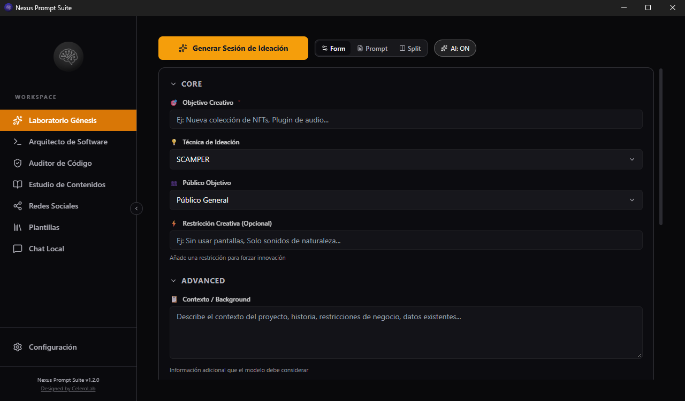
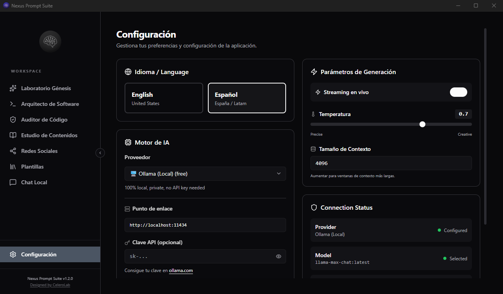

# ⚡ Nexus Prompt Suite

> Stop wrestling with AI. Start getting answers worth keeping.

**Nexus Prompt Suite is a desktop app that turns a blank prompt box into a
workshop.** Pick a goal, answer a few clear questions, and Nexus composes the
kind of structured prompt that gets you dramatically better output from any
large language model — every single time, without the trial and error.

Built with Tauri and Rust, it lives entirely on your machine. No servers, no
tracking, no accounts. Your prompts, your preferences, and your API keys never
leave your computer.

<p align="center">
  
</p>

---

## Why you'll like it

Most people talk to AI the same way they talk to a search engine: a
half-formed sentence, a hope, and a shrug. That works about as well as you'd
expect. Nexus changes the game by giving the model what it actually needs to do
its best work — clear intent, relevant context, and the right constraints.

| What | How it helps |
| :--- | :--- |
| **Better answers, less re-rolling** | Structured prompts built the right way mean fewer "let me try that again" rounds. |
| **Your data stays yours** | Everything runs locally. API keys live in your operating system's secure keychain, encrypted at rest. |
| **No accounts, no telemetry** | Fire it up and it's yours. There is nothing watching. |
| **One app for every model** | Bring your own local model or plug into any major provider — switch in a couple of clicks. |

---

## What you can do with it

Six purpose-built workspaces, each shaped around a real job:

- **🧬 Genesis Lab** — Kickstart creative work with seven proven ideation
  techniques (SCAMPER, Six Thinking Hats, Blue Ocean and more). Great when the
  page is blank and so are you.
- **💻 Software Architect** — Turn a feature idea into a dense, production-ready
  technical brief. Supports nine project types and injects security constraints
  automatically.
- **🛡️ Code Auditor** — Give a codebase a focused security review aligned with
  real-world compliance frameworks.
- **🎨 Content Studio** — Shape ideas into blog posts, whitepapers, scripts and
  more, with audience and SEO baked in.
- **📱 Social Strategist** — Build multi-channel campaigns with hooks and
  persuasion frameworks that actually get attention.
- **📋 Template Library** — A curated library of bilingual (ES/EN) templates
  across DevOps, security, writing, business, social and creative work.

Three view modes let you work the way you prefer: a guided **form**, a raw
**prompt editor**, or a **split** view with the form on one side and the
generated prompt updating beside it.

### No more orphan variables

Every dropdown comes pre-filled with a sensible default, so you never have to
touch them unless you want to. When Nexus rewrites your draft into a polished
prompt, the AI **uses the concrete values you provided** — it's forbidden from
inventing vague `{{placeholder}}` tokens. If a piece of information is genuinely
missing, it's flagged plainly in the output (`[FALTA: …]` / `[MISSING: …]`),
and an on-screen warning highlights any unfinished variable before you copy the
prompt. You always know exactly what's going into the model.

---

## Every model you already use, in one place

Nexus connects to a dozen providers out of the box. Start local with something
private, or plug straight into a hosted model.

| Provider | Notes |
| :--- | :--- |
| **Ollama** | 100% local and free. Optionally protect it with an API key; runs just as happily without one. |
| **OpenAI, OpenRouter, Groq, Together** | Cloud models with an API key. Nexus pulls the real, current model list — no stale defaults. |
| **Anthropic Claude, Google Gemini** | Fully supported, with live model discovery where available. |
| **LM Studio, OpenWebUI, vLLM** | Point at your own self-hosted endpoint. |
| **OpenCode Zen, OpenCode Go** | For those who live in OpenCode. |

<p align="center">
  
</p>

**One small but important detail:** when you pick a provider, Nexus asks that
provider for its real, current model list instead of trusting a hardcoded list
that goes stale. And your settings — model, temperature, context size — persist
between sessions, so the app remembers how you like to work when you come back.

**Security hardened by default.** Connection endpoints are validated strictly —
remote plain-HTTP targets are rejected, local ports are confined to an
allow-list, attempts to embed credentials in URLs are refused, and request timeouts
keep hostile or unresponsive endpoints from hanging the app. API keys never live in
the config or the UI state: they're stored encrypted in your operating system's
secure keychain and resolved only when a request is actually made.

---

## Getting started

**Running in under two minutes.**

1. **Download** the installer for your platform from
   [nexus.celerolab.com](https://nexus.celerolab.com) — Windows, macOS, or Linux.
2. **Install and launch.** On macOS, first launch may need your confirmation.
3. **Choose a provider** in Settings.
   - Prefer privacy? Pick **Ollama** and run models entirely on your hardware.
   - Prefer the cloud? Add your API key and pick a model.
4. **Pick a suite, answer a few questions, generate.** That's it.

---

## The nerdy part (for those who want it)

Built on **Tauri v2**, **Rust**, and **React**, with streaming via SSE, rate
limiting protection, strict endpoint validation, and an encrypted local store
that uses only your OS keychain. Every generated prompt is scanned for leftover
`{{placeholder}}` tokens against both the raw draft and the final AI-rewritten
output, so nothing slips through. If you'd like to run it from
source or contribute, head to [DEVELOPMENT.md](DEVELOPMENT.md) for the full
setup and architecture overview.

```bash
git clone https://github.com/ekosistema/nexus-prompt-suite.git
cd nexus-prompt-suite/prompt-suite
npm install
npm run tauri dev
```

---

## Contributing

Nexus is open source (MIT). Found a bug, want a new suite, or can make any
template better? We'd love the help.

- **Report a bug** or request a feature in the
  [issues](https://github.com/ekosistema/nexus-prompt-suite/issues).
- **Contribute code** — fork, branch, make a change, and open a pull request.
  Both test suites (frontend and backend) must pass.

---

## License & credits

Licensed under the **MIT License**. See [LICENSE](LICENSE) for the full text.

Nexus stands on the work of a brilliant open-source ecosystem — Tauri, Rust,
React, and many more. Thank you to those communities, and to the teams behind
OpenAI, Anthropic, Google Gemini, Ollama, and OpenRouter for the APIs that make
this possible.

<p align="center">
  Built with care by <a href="https://celerolab.com">CeleroLab</a><br />
  <a href="https://celerolab.com">celerolab.com</a> ·
  <a href="mailto:info@celerolab.com">Support</a>
  <br /><em>Copyright © 2026</em>
</p>