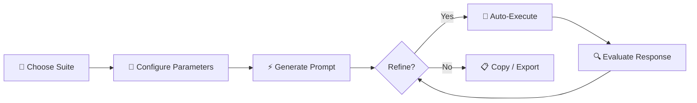
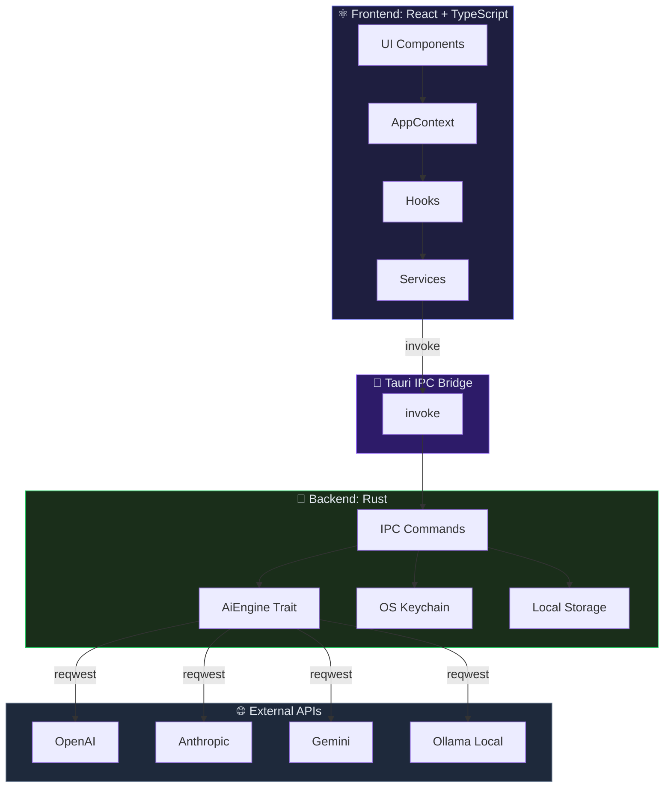

# ⚡ Nexus Prompt Suite

> **Your local-first command center for professional AI prompt engineering.** Build structured, secure, and surgically precise prompts to maximize the performance of any LLM.

<p align="center">
  
  
  
  
  
  
  
  
</p>

---

## 💡 About Nexus Prompt Suite

**Nexus Prompt Suite** is a high-performance desktop application built with **Tauri v2**, **Rust**, and **React**. Designed for developers, content creators, and AI architects, it enables structured, secure, and precise prompt generation that elevates response quality from any LLM — GPT-4o, Claude 3.5 Sonnet, Gemini 1.5 Pro, Llama 3 — without ever compromising your data privacy.

Unlike web-based tools that send your data to external servers, Nexus operates **100% locally**: your prompts, settings, and API keys never leave your machine.

### ✨ Key Features

| Feature | Description |
| :--- | :--- |
| 🔒 **Total Privacy** | No servers, no telemetry, no trackers. API keys are encrypted and stored in the OS-native keychain (Keychain/Credential Manager/Secret Service). |
| 🧬 **Genesis Lab** | Universal creative prompt generator with 7 ideation techniques (SCAMPER, Mash-up, First Principles, Blue Ocean, Six Thinking Hats, etc.) and 4 prompting modes (Direct, CoT, Zero-shot CoT, Tree of Thought). |
| 💻 **Software Architect** | High-density technical prompt compiler. Supports 9 project types, multiple tech stacks, 6 strategic focus areas, and prompts with built-in security and testing constraints. |
| 🛡️ **Code Auditor** | Code auditing with 8 scan types (SAST, SCA, Secrets, OWASP Top 10, Input Validation, Auth, Error Handling), automatic language detection, and reports aligned with compliance frameworks (SOC2, ISO27001, PCI-DSS, HIPAA, GDPR). |
| 🎨 **Content Studio** | Transforms concepts into 15 content formats (blog, whitepaper, podcast, infographic, email, video script). With audience profiles, mental frameworks (First Principles, Feynman, Pareto), and SEO optimization. |
| 📱 **Social Strategist** | Multi-channel strategies with high-engagement hooks, psychological triggers (Social Proof, Scarcity, Authority), persuasive frameworks (PAS, AIDA, Storytelling), and an integrated visual brief for AI image generators. |
| 📋 **Template Library** | Over 60 bilingual templates (ES/EN) ready to use: DevOps, Security, Writing, Business, Social Media, Creative, and more. With customizable variables and support for custom templates. |
| 🌐 **12 AI Providers** | Ollama (local), OpenAI, OpenRouter, Groq, LM Studio, OpenWebUI, vLLM, Together AI, Anthropic, Gemini, OpenCode Zen, and OpenCode Go. Both streaming and non-streaming inference. |
| 🌍 **Bilingual** | Fully localized UI in Spanish and English with hot-swap language switching. |

---

## 🚀 Quick Start

Get Nexus Prompt Suite running on your machine in **under 2 minutes**:

### 1. Download the installer

Go to the [Releases page](https://github.com/ekosistema/nexus-prompt-suite/releases) and download the binary for your operating system:

| Platform | Format |
| :--- | :--- |
| 🪟 **Windows** | `.exe` / `.msi` |
| 🍎 **macOS** | `.dmg` (Apple Silicon + Intel) |
| 🐧 **Linux** | `.deb` / `.AppImage` / `.rpm` |

### 2. Install and run

Run the downloaded installer. On macOS, if the system blocks the app because it comes from an unidentified developer:

```bash
# Option A: Right-click → Open in the Applications folder
# Option B: From terminal
sudo xattr -cr /Applications/Nexus\ Prompt\ Suite.app
```

### 3. Configure your AI provider

Open the app and go to **Settings** (⚙️). Choose your preferred provider:

- **Ollama** (recommended for full privacy): the model runs on your hardware with no external connection.
- **OpenAI / OpenRouter / Anthropic / Gemini**: enter your API key and select the desired model.

Done. You're ready to generate professional-quality prompts.

---

## ⚙️ Installation

### Prerequisites

| Tool | Required version | Installation |
| :--- | :--- | :--- |
| **Node.js** | `>= 20.0.0` | [nodejs.org](https://nodejs.org) |
| **Rust** | `>= 1.77.2` | [rustup.rs](https://rustup.rs) |
| **Git** | `>= 2.30` | [git-scm.com](https://git-scm.com) |

#### System dependencies by platform

**Linux (Ubuntu/Debian):**
```bash
sudo apt update && sudo apt install -y \
  libwebkit2gtk-4.1-dev \
  libssl-dev \
  libgtk-3-dev \
  libayatana-appindicator3-dev \
  librsvg2-dev
```

**macOS:** Xcode Command Line Tools.
```bash
xcode-select --install
```

**Windows:** WebView2 (preinstalled on Windows 10/11). Microsoft Visual Studio C++ Build Tools.

### Build from source

```bash
# 1. Clone the repo
git clone https://github.com/ekosistema/nexus-prompt-suite.git
cd nexus-prompt-suite/prompt-suite

# 2. Install frontend dependencies
npm install --legacy-peer-deps

# 3. Build and run in dev mode
npm run tauri dev

# 4. Production build
npm run tauri build
```

### Environment variables

| Variable | Description | Required |
| :--- | :--- | :--- |
| `TAURI_SIGNING_PRIVATE_KEY` | Private key for binary signing (CI/release only) | No |
| `TAURI_SIGNING_PRIVATE_KEY_PASSWORD` | Signing key password | No |

> 💡 **Note:** API keys are managed through the Settings UI and stored securely in the OS keychain via `keyring-rs`. **Never** include them in environment variables or `.env` files.

---

## 💻 Usage & Examples

The app offers **3 interchangeable view modes**:

- **Form Mode**: Guided construction via dynamic forms with contextual validation.
- **Prompt Mode**: Direct raw prompt editor with syntax highlighting and token counter.
- **Split Mode**: Split view with the form on the left and the generated prompt on the right.

### Typical workflow



### Practical example: generating a software architecture prompt

```
1. Open Software Architect
2. Select:
   - Project Type: Web
   - Architecture: Microservices
   - Strategic Focus: Performance + Security
   - Tech Stack: Rust (Backend), React (Frontend)
   - Database: PostgreSQL
   - Deployment: AWS (ECS + RDS)
   - Testing: E2E + Integration
   - Output Granularity: Detailed
3. Click "Generate Prompt"
4. The system builds a structured prompt with:
   - Chain of Thought step-by-step reasoning
   - Role definition for the LLM
   - OWASP security constraints
   - Performance specifications (<100ms p95)
   - Structured Markdown output format
```

---

## 🌐 AI Providers

| ID | Provider | Auth | Default Model |
| :--- | :--- | :--- | :--- |
| `ollama` | Ollama (Local) | — | `llama3.2:latest` |
| `openai` | OpenAI | API Key (Bearer) | `gpt-4o` |
| `openrouter` | OpenRouter | API Key (Bearer) | `openai/gpt-4o` |
| `groq` | Groq | API Key (Bearer) | `llama-3.3-70b-versatile` |
| `lmstudio` | LM Studio (Local) | — | `local-model` |
| `openwebui` | OpenWebUI | API Key (Bearer) | `local-model` |
| `vllm` | vLLM | API Key (Bearer) | `local-model` |
| `together` | Together AI | API Key (Bearer) | `meta-llama/Llama-3.3-70B-Instruct` |
| `anthropic` | Anthropic | API Key (x-api-key) | `claude-3-5-sonnet-20241022` |
| `gemini` | Google Gemini | API Key (query param) | `gemini-1.5-pro` |
| `opencode_zen` | OpenCode Zen | API Key (Bearer) | `opencode/zen` |
| `opencode_go` | OpenCode Go | API Key (Bearer) | `opencode/go` |

---

## 🏗️ Architecture



### Design Principles

| Principle | Implementation |
| :--- | :--- |
| **Secure by default** | API keys encrypted in OS Keychain (never in plain text on disk). JSON sanitization before persistence. 1MB file read cap (CWE-400 mitigation). |
| **Radical privacy** | Zero telemetry, zero servers, zero external logging. Everything runs locally. |
| **Native performance** | Rust backend with async `reqwest` + SSE streaming. React frontend with Vite tree-shaking and lazy loading. |
| **Strict typing** | TypeScript `strict: true` on the frontend. Algebraic types and trait system in Rust on the backend. |
| **Extensibility** | Provider architecture via `AiEngine` trait. Templates defined as data (not hardcoded in UI). |

---

## 📄 License

This project is licensed under the **MIT License**.

```
MIT License

Copyright (c) 2026 CeleroLab

Permission is hereby granted, free of charge, to any person obtaining a copy
of this software and associated documentation files...
```

---

## 🙏 Credits & Acknowledgements

Nexus Prompt Suite would not be possible without the exceptional work of these projects and communities:

| Technology | Role |
| :--- | :--- |
| [**Tauri v2**](https://v2.tauri.app) | Cross-platform desktop framework — the bridge between Rust and the web frontend |
| [**Rust**](https://www.rust-lang.org) | Core language — memory safety and native performance without compromise |
| [**React 18**](https://react.dev) | UI library — declarative components and efficient rendering |
| [**Vite**](https://vitejs.dev) | Bundler — instant HMR and optimized builds with tree-shaking |
| [**Tailwind CSS**](https://tailwindcss.com) | Utility CSS framework — dark theme with HSL design tokens |
| [**reqwest**](https://docs.rs/reqwest) | Async HTTP client in Rust — communication with AI APIs |
| [**keyring-rs**](https://crates.io/crates/keyring) | Native cryptographic storage — Keychain (macOS), Credential Manager (Windows), Secret Service (Linux) |
| [**Vitest**](https://vitest.dev) | Frontend testing framework — Vite-compatible and fast by default |
| [**Lucide React**](https://lucide.dev) | Consistent, minimalist open-source icons |
| [**serde**](https://serde.rs) | High-performance serialization for Rust |

---

<p align="center">
  <strong>⚡ Nexus Prompt Suite</strong><br />
  Potentiating human intelligence with AI.<br /><br />
  Built with passion by <a href="https://celerolab.com"><strong>CeleroLab</strong></a><br />
  Copyright © 2026 &nbsp;|&nbsp;
  <a href="https://celerolab.com">celerolab.com</a> &nbsp;|&nbsp;
  <a href="https://github.com/ekosistema/nexus-prompt-suite">GitHub</a> &nbsp;|&nbsp;
  <a href="mailto:info@celerolab.com">Technical Support</a>
</p>
